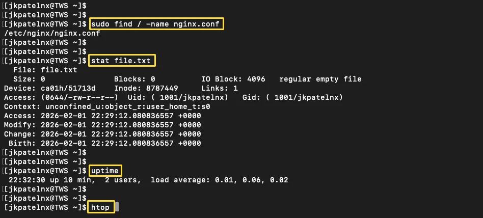
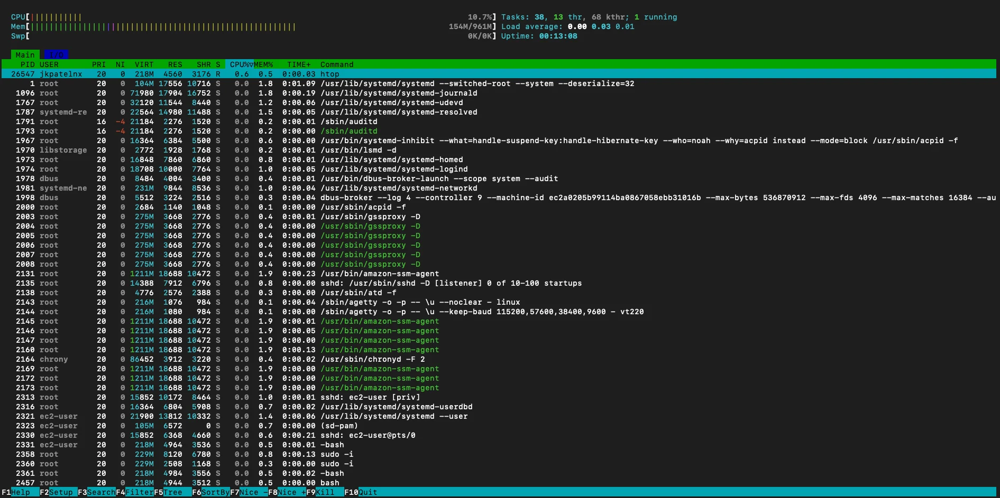
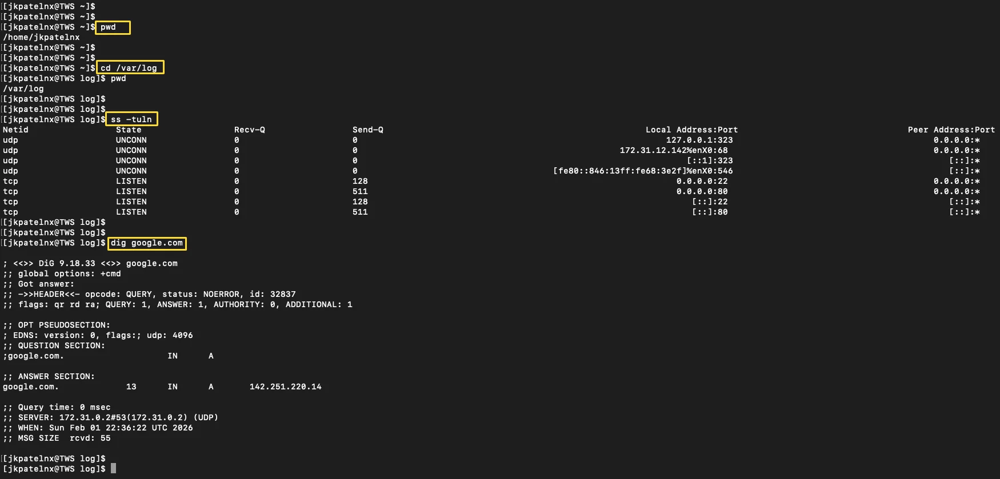

# Linux Commands Cheatsheet
 From managing processes and disks to debugging networks and services, these Linux commands are used daily in real-world

### 1\. Linux Process Management Commands (Revision Notes)

| No. | Command | Purpose | When to Use |
| --- | --- | --- | --- |
| 1 | `ps aux` | Show all running processes with user and resource usage | Quickly list all active processes |
| 2 | `top` | Real-time view of CPU, memory usage, and running processes | Monitor system performance live |
| 3 | `htop` | Enhanced and interactive process viewer (if installed) | Easier and more readable alternative to `top` |
| 4 | `pidof nginx` | Get the process ID (PID) of a running service | Find PID without searching manually |
| 5 | `kill <PID>` | Gracefully stop a process using its PID | Safely terminate a process |
| 6 | `kill -9 <PID>` | Force kill a process immediately | Use only when normal kill fails |
| 7 | `pkill node` | Kill processes by name instead of PID | Stop multiple processes at once |
| 8 | `uptime` | Show system running time and load average | Check system health and load |
| 9 | `watch -n 2 ps aux` | Run a command repeatedly at fixed intervals | Continuous monitoring of 

### 2\. File System & Disk Commands (Revision Notes)

| No. | Command | Purpose | When to Use |
| --- | --- | --- | --- |
| 1 | `ls -lah` | List files with permissions, size, and hidden files | Inspect directory contents in detail |
| 2 | `pwd` | Show the current working directory | Confirm your current location |
| 3 | `cd /var/log` | Change directory | Navigate to system log files |
| 4 | `du -sh *` | Show disk usage of files and folders | Identify large files or directories |
| 5 | `df -h` | Display disk space usage in human-readable format | Check available disk space |
| 6 | `stat file.txt` | Show detailed metadata of a file | View timestamps, inode, and permissions |
| 7 | `find / -name nginx.conf` | Search for files by name | Locate configuration files |
| 8 | `chmod 644 file.txt` | Change file permissions | Set correct read/write access |
| 9 | `chown user:user file.txt` | Change file ownership | Fix ownership and access issues |

### 3\. Networking & Troubleshooting Commands (Revision Notes)

| # | Command | Purpose | When to Use |
| --- | --- | --- | --- |
| 1 | `ip addr` | Show network interfaces and IP addresses | Verify IP configuration |
| 2 | `ping google.com` | Test network connectivity and latency | Check if a host is reachable |
| 3 | `ss -tuln` | Show listening ports and services | Identify open ports and running services |
| 4 | `curl -I https://example.com` | Fetch HTTP response headers | Validate website or API availability |
| 5 | `dig google.com` | DNS lookup and troubleshooting | Debug DNS resolution issues |
| 6 | `traceroute google.com` | Trace the network path to a host | Identify where network delays occur |

---
The screenshots below demonstrate practical usage of commonly used Linux commands for file inspection, process monitoring, and basic system troubleshooting.

  

 

 