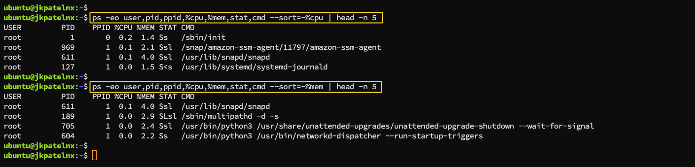
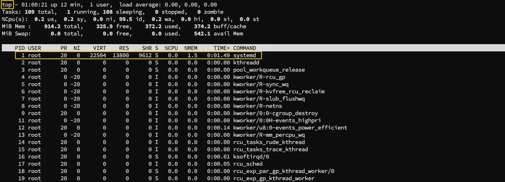
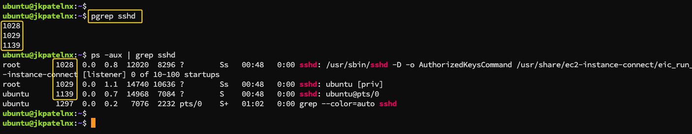
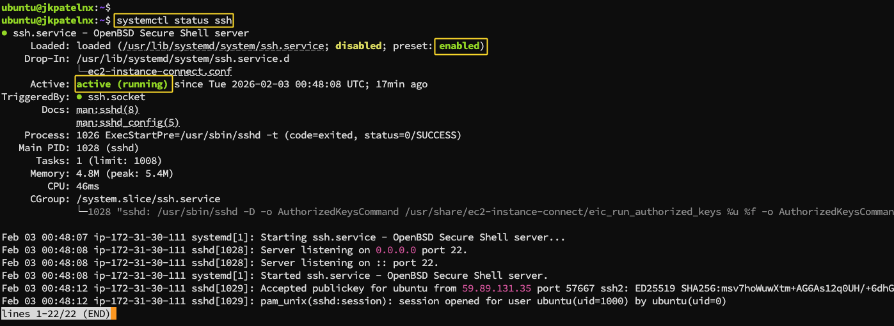
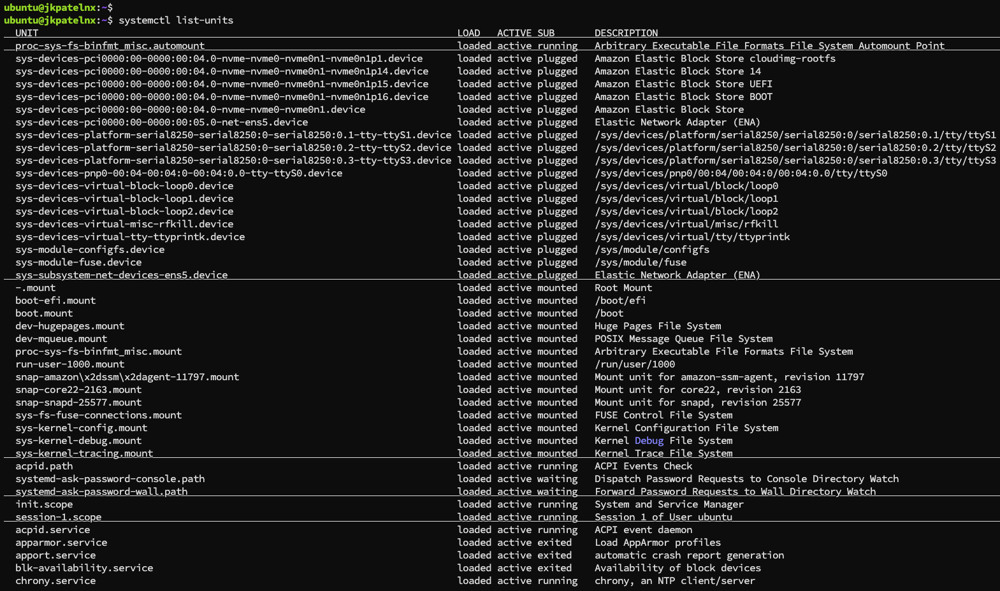
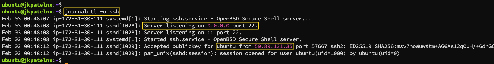
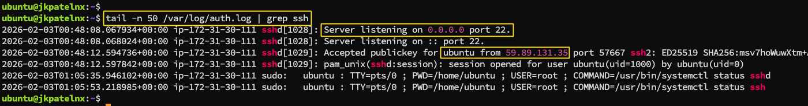

# Linux Processes and Services: Hands-On Troubleshooting Practice for DevOps

###  1\. Checking Running Processes
* `ps` to list running processes  
* `top` to monitor processes in real time  
* `pgrep` to search for specific processes These commands are commonly used during performance analysis and incident investigation.

 
 
 

### 2\. Inspecting a systemd Service
* `systemctl status <servicen-name>` to check service health  
* `systemctl list-units` to view active services Understanding these commands is critical when diagnosing service failures or confirming whether a service is operational after configuration changes.

 
 

### 3\. Viewing Logs and Basic Troubleshooting
* `journalctl -u <service-name>` to view service logs
* `tail -n 50 <log-file-name>` to inspect recent log entries

 
 

### 4\. Capturing a Simple Linux Troubleshooting Flow
The troubleshooting flow included:

* Verifying the service status 
* Restarting the service when necessary
* Rechecking logs to confirm normal operation This simple flow shows how multiple Linux commands work together to diagnose and resolve issues efficiently.
    