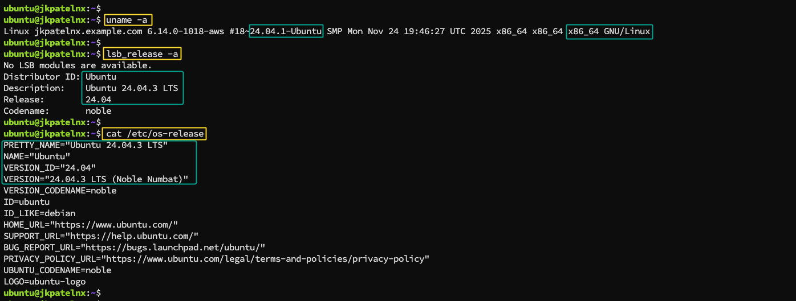
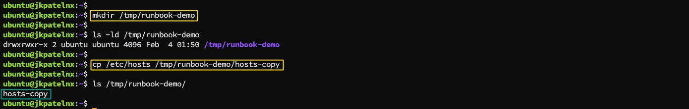
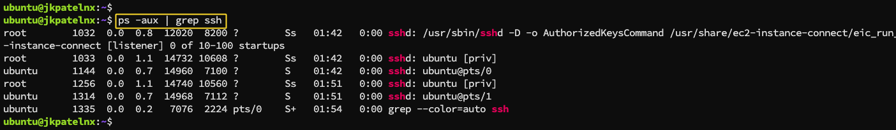
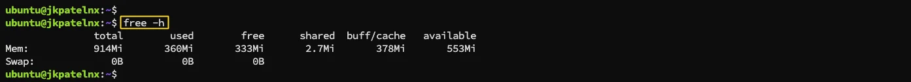
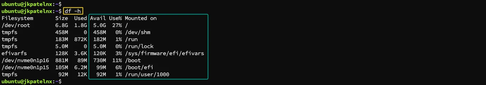
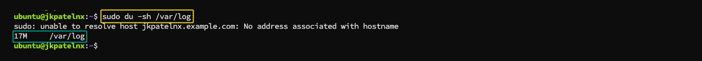
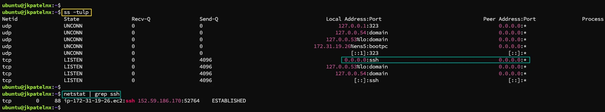
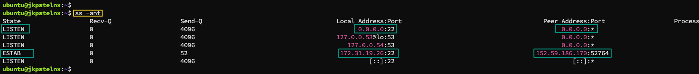
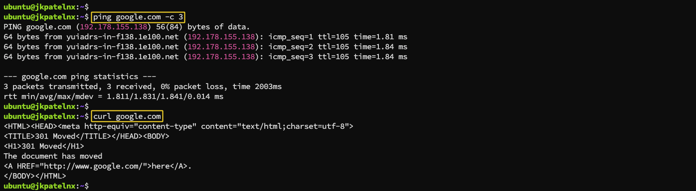
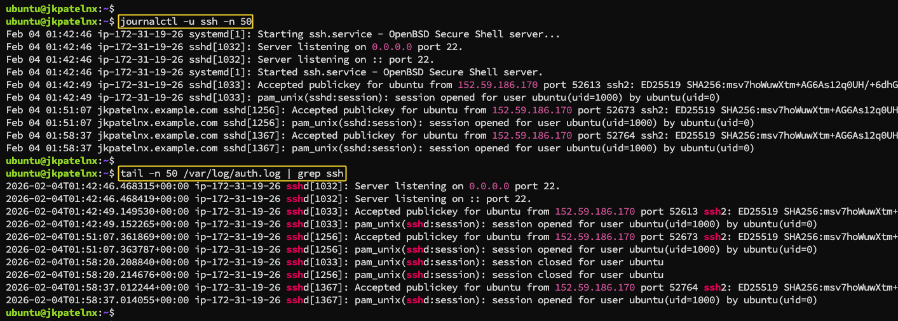

# Linux Troubleshooting Run-book for DevOps: CPU, Memory, Disk, and Logs

### Step 1: Environment Basics (Know Your System)
* `uname -a` : This command helps identify Kernel version, Architecture, Kernel build details. Observation to note: Confirm the system is running a stable kernel and expected architecture.  
* `lsb_release -a` or `cat /etc/os-release` : This confirms Linux distribution, OS version, Codename. Observation to note: Useful when debugging OS-specific behavior, package issues, or log locations.

 

### Step 2: Filesystem Sanity (Basic Health Check)
* `mkdir /tmp/runbook-demo` : Creating a temporary directory verifies Filesystem is writable, No permission or mount issues. Observation to note: Successful creation indicates basic filesystem health.
* `cp /etc/hosts /tmp/runbook-demo/hosts-copy && ls -l` : This checks File read/write capability, Disk responsiveness. Observation to note: No delay or error means disk access is functioning normally.

 

### Step 3: CPU and Memory Snapshot
* `ps or top / htop` : These commands help identify: CPU usage of sshd, Memory consumption, Unexpected spikes. Observation to note: SSH should consume minimal CPU and memory under normal conditions.
* `free -h` : This gives insight into Available memory, Swap usage, Memory pressure. Observation to note: Low available memory or heavy swap usage is a warning sign.

 
 

### Step 4: Disk and IO Health
* `df -h` : Used to check Disk space usage, Mounted filesystems nearing full capacity. Observation to note: Any partition above 80–85% usage needs attention.
* `du -sh /var/log` : Helps detect: Excessive log growth, Misconfigured logging. Observation to note: Rapid log growth often indicates application or authentication issues.

 
 

### Step 5: Network Checks
* `ss -tulpn` or `netstat` : This confirms: SSH is listening on the expected port, Correct protocol binding. Observation to note: Missing or incorrect bindings indicate service or firewall issues.
* `ping` or `curl` : Used to verify Basic network connectivity, Local or remote reachability. Observation to note: Packet loss or delays suggest network instability.

 
 
 

### Step 6: Log Analysis (Most Important Step)
* `journalctl -u ssh -n 50` : This helps inspect Service startup errors, Authentication problems, Crashes or restarts. Observation to note: Repeated errors or warnings indicate deeper issues. 
* `tail -n 50 /var/log/auth.log` : This reveals Login attempts, Security warnings, Permission failures. Observation to note: Multiple failed logins may indicate attacks or misconfiguration.

 

### If This Worsens (Next Actions)

If the issue escalates, the run-book should guide your next move:
1. `Restart` the service gracefully during a safe window  
2. Increase logging verbosity to capture deeper insights
3. Use advanced tools like `strace` or enable audit logs for investigation

